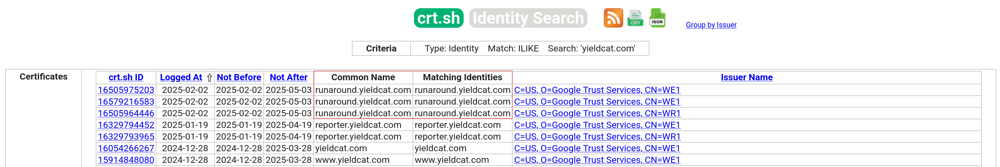
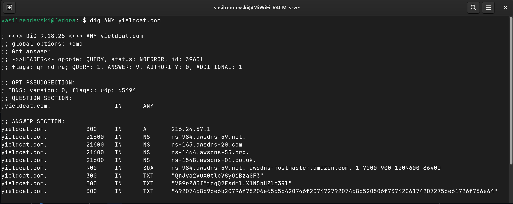
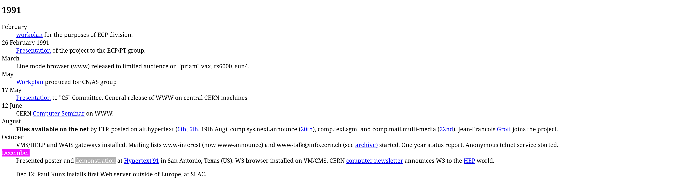
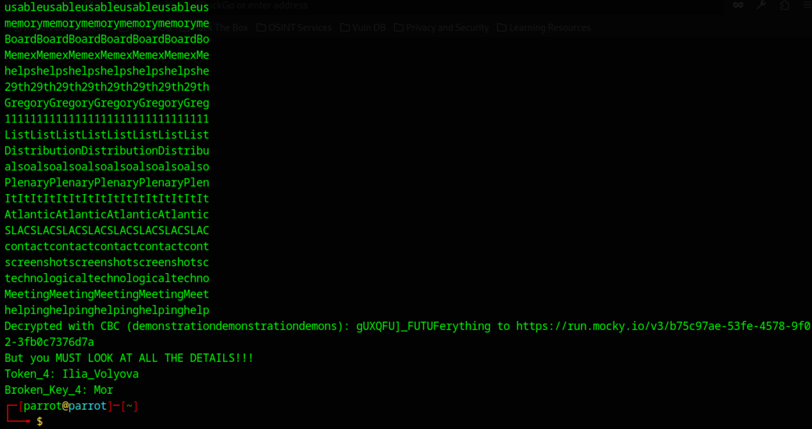
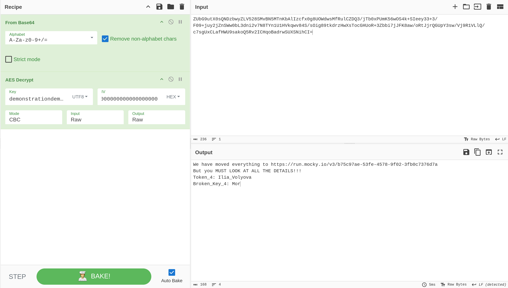
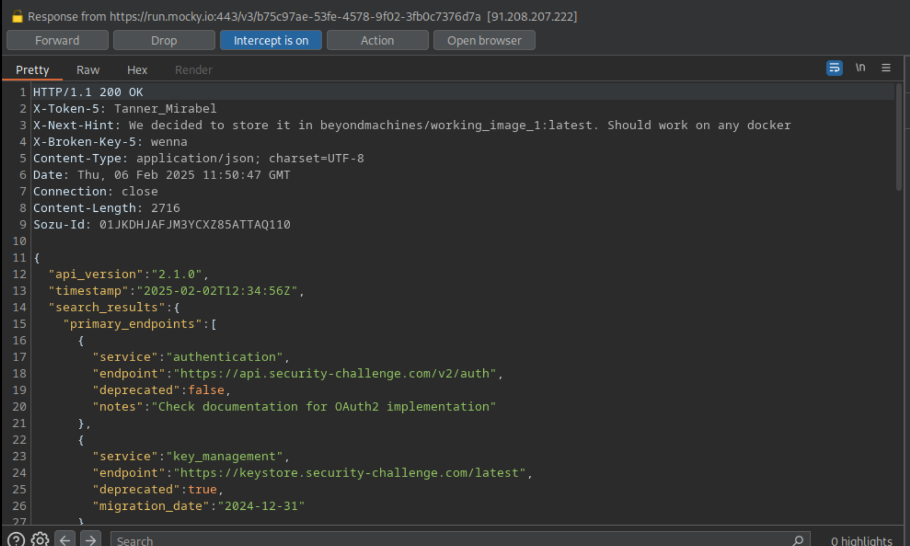

# ByteBreach 2025.1 - Writeup

ByteBreach 2025.1 challenged participants with a series of sequential OSINT puzzles designed to test both technical acumen and creative problem-solving. In this writeup, I detail each step of my journey through the challenges, sharing insights and the lessons learned along the way.

---

## **Token 1: Subdomain Discovery**
### **Challenge Introduction**
Navigating to challenge.beyondmachines.net and clicking the `Start Challenge` button we get:
```
I have my suspicions...

Hey there. I think I've seen some people in the YieldCat.com team are building some other platform.

I think they are going to mess up the security, and you should investigate.

I know I'm sending you on a wild runaround. But so are the hackers, and they will start with some OSINT.

Just be very patient.
```
## **What Didn’t Work & Why**
Initially, I assumed the challenge required OSINT on social media accounts related to the challenge. However, this approach yielded no useful results. A hint from @RevanchistX made me realize that OSINT includes DNS enumeration, which I had incorrectly assumed was active enumeration. Combining this insight with the hint that `the YieldCat.com team is building some other platform`, I decided to proceed with subdomain enumeration.

### **Step 1: Enumerating Subdomains from CT logs with crt.sh**
Since SSL/TLS certificates are publicly logged in **Certificate Transparency (CT) logs**, we can use **crt.sh** to check for any subdomains that have been issued certificates.

I performed a search on **crt.sh** using the domain `yieldcat.com`:
- **URL:** [https://crt.sh/?q=%.yieldcat.com](https://crt.sh/?q=%.yieldcat.com)  
- **Query Used:** `%.yieldcat.com` (Finds all subdomains of `yieldcat.com`)



*Note: This method only works if a certificate for yieldcat.com (or its subdomains) has been issued and logged in Certificate Transparency (CT). Otherwise, alternative subdomain enumeration methods would be required.*

### **Step 2: Navigating the Subdomains and Decoding**
After testing the discovered subdomains, `runaround.yieldcat.com` returned a Base64-encoded response:
```Base64
eyJtZXNzYWdlIjogIkV2ZW4gaWYgaXQncyBub3QgRE5TLCBpdCdzIGFsd2F5cyBETlMiLCAiZGF0YSI6IHsiVG9rZW5fMSI6ICJBbmFfS2hvdXJpIiwgIkJyb2tlbl9LZXlfMSI6ICJTY3JpbSJ9fQ==
```
We can use various tools to decode the Base64 string, but I prefer [CyberChef](https://gchq.github.io/CyberChef/):
```json
{
  "message": "Even if it's not DNS, it's always DNS",
  "data": {
    "Token_1": "Ana_Khouri",
    "Broken_Key_1": "Scrim"
  }
}
```

---

## **Token 2: DNS Enumeration**

Using the hint provided in the `message` field of the previous JSON response I proceeded with DNS record enumeration:



I identified three intriguing TXT records that appeared to be encoded. Through trial and error, I determined that the first two were Base64-encoded, while the third was HEX-encoded.

Encoded:
```
QnJva2VuX0tleV8yOiBzaGF3
VG9rZW5fMjogQ2FsdmluX1N5bHZlc3Rl
49207468696e6b20796f75206e65656420746f207472792074686520506f73742061742072756e61726f756e64
```
Decoded:
```
Broken_Key_2: shaw
Token_2: Calvin_Sylveste
I think you need to try the Post at runaround
```

---

## **Token 3: POST request at runaround.yieldcat.com**

Using the hint from the previous token, I attempted a POST request to runaround.yieldcat.com
```bash
curl https://runaround.yieldcat.com -X POST
```
The response included a Base64 encoded string:
```
eyJtZXNzYWdlIjogIkkga2VlcCB0aGUgd2VhcG9ucyBjYWNoZSBpbiBteSBub3N0YWxnaWFmb3JpbmZpbml0eSBidWNrZXQgaW4gdGhlIHVzIGVhc3Qgb25lLCBpbiBhIHRleHQgYWJvdXQgcGF0dGVybl9qdWdnbGVycyIsICJkYXRhIjogeyJUb2tlbl8zIjogIk5ldmlsX0NsYXZhaW4iLCAiQnJva2VuX0tleV8zIjogIlN1aXQifX0=
```
Decoding it gives us:
```
{"message": "I keep the weapons cache in my nostalgiaforinfinity bucket in the us east one, in a text about pattern_jugglers", "data": {"Token_3": "Nevil_Clavain", "Broken_Key_3": "Suit"}}
```

---

## **Token 4: AES256 Decryption**

### **Step 1: Navigating to the S3 bucket** 

The challenge hint suggests that a 'weapons cache' is stored in an **S3 bucket** named **nostalgiaforinfinity** in the **us-east-1** region in a **txt** file named **pattern_jugglers**.
Amazon S3 buckets follow a standard URL format:
```
https://BUCKET_NAME.s3.REGION.amazonaws.com/
```
Substituting the given details:
```
https://nostalgiaforinfinity.s3.us-east-1.amazonaws.com/pattern_jugglers.txt
```
Accessing the URL gives us:
```
I've been working hard to find the secrets. 

This is no longer a safe place to share data. 

I don't even want to leave stuff obvious so i put it in AES256 crypt. Do your work for the key, repetition is the mother of all knowledge: https://www.w3.org/History.html [1991/December/4]

ZUbG9utX0sQNDzbwyZLV528SMvBN5MTnKbAlIzcfx0g8UOWdwsMfRulCZDQ3/jTb0xPUmK56wOS4k+SIeey33+3/F09+juy2jZnSWw0bL3dni2v7N8TYn1U1HVkqwv84S/sOig89tkdrzHwXsTocGHUoR+3Zbbi7jJFK8aw/oRtJjrQGUpY3sw/Vj9R1VLlQ/c7sgUxCLafHWU9sakoQ5Rv2ICHqoBadrwSUXSNihCI=
```

### **Step 2: AES256 Key Derivation**
*Note: This token underwent several changes during the challenge. The current version of the token might be slightly different from the one in this writeup.*

This was, by far, the most challenging token in the challenge. Initially, I assumed the `broken_keys` provided with each token were meant to be used here. However, a quick test in [CyberChef](https://gchq.github.io/CyberChef/) ruled out this possibility.

I decided to take a step back and systematically analyze all the available information:
- We need to somehow derive the key.
- The key needs to be 32 characters long (256 bits = 32 bytes).
- We don't know what mode of AES was used (ECB, CBC, etc.).

Given the hint `repetition is the mother of all knowledge`, I inferred that the key might involve repeating a word until it reached 32 characters.

To derive the key, I focused on the provided webpage, `https://www.w3.org/History.html`, and the date `1991/December/4`. Upon navigating the page, I found a section titled *1991* and a subsection titled *December*, but there was no explicit mention of the number *4*. I later learned that the *'4'* in the 'date' represented the *4'th* word of the subsection.



During the challenge, I wrote a Python script to scrape every word from the site, repeated it until 32 characters and used it as a key in both ECB and CBC mode (with null bytes for the IV) and made sure it only contained ASCII characters. You can find the script attached to this repository.





#### To summarize:
I wrote a script to:
- Scrape every word from `https://www.w3.org/History.html`.
- Repeat it until 32 characters.
- Use it as a key in both ECB and CBC mode (with null byte IV).
- Stop if it contains only printable ASCII characters.

```
We have moved everything to https://run.mocky.io/v3/b75c97ae-53fe-4578-9f02-3fb0c7376d7a
But you MUST LOOK AT ALL THE DETAILS!!!
Token_4: Ilia_Volyova
Broken_Key_4: Mor
```
---

## **Token 5: Mock API Headers**
Navigating to `https://run.mocky.io/v3/b75c97ae-53fe-4578-9f02-3fb0c7376d7a` we are met with a mock API.
```
{
  "api_version": "2.1.0",
  "timestamp": "2025-02-02T12:34:56Z",
  "search_results": {
    "primary_endpoints": [
      {
        "service": "authentication",
        "endpoint": "https://api.security-challenge.com/v2/auth",
        "deprecated": false,
        "notes": "Check documentation for OAuth2 implementation"
      },
      {
        "service": "key_management",
        "endpoint": "https://keystore.security-challenge.com/latest",
        "deprecated": true,
        "migration_date": "2024-12-31"
      }
    ],
    "potential_matches": [
      {
        "id": "TK_8675309",
        "location": "gs://security-bucket-v2/tokens/archived/",
        "access_level": "restricted",
        "last_updated": "2024-11-15"
      }
<SNIPPED>
```
Initially, I thought this token required finding a Microsoft or Google Cloud storage link or a hidden page on runaround.yieldcat.com. However, the solution was hiding in plain sight within the HTTP headers. Intercepting the request with Burp Suite we get token 5:



---

## **Token 6: Docker and GPG decryption**

### **Step 1: Pulling the Docker Continer and Enumerating files**
The previous token hints toward a docker container named `beyondmachines/working_image_1:latest`.
With Docker installed, we can pull the Docker image from Docker Hub:
```
docker pull beyondmachines/working_image_1:latest
```
Once the image is pulled, we can run the container:
```
docker run -it beyondmachines/working_image_1:latest /bin/sh
```
This will drop us into an interactive shell within the container. Listing the current directory we get the following output:
```bash
# ls -la
total 24
drwxr-xr-x    1 root     root          4096 Feb  2 17:49 .
drwxr-xr-x    1 root     root          4096 Feb 12 19:18 ..
-rw-r--r--    1 root     root           366 Feb  2 17:49 Dockerfile
-rw-r--r--    1 root     root           417 Feb  2 17:41 app.py
-rw-r--r--    1 root     root           114 Feb  2 17:42 final_token.txt.gpg
-rw-r--r--    1 root     root             5 Feb  2 17:41 requirements.txt
```

### **Step 2: GPG file decryption**
Since this was the final token, I deduced that the `broken_keys` had to be used to decrypt the GPG file using the following command:
```
gpg --decrypt secrets.gpg
```
Using `ScrimshawSuitMorwenna` as the passphrase, I decrypted the file to reveal the final token:
```
Token_6: Schuyler_Sky_Haussmann
```

# Conclusion
ByteBreach 2025.1 was an exciting challenge that reinforced the importance of methodical OSINT techniques and problem-solving. Throughout the journey, I learned to refine my approach, adapt to unexpected hurdles, and leverage both manual and automated tools efficiently. This challenge also highlighted the need for both creativity and technical precision in cybersecurity. I look forward to applying these lessons in future challenges and continuing to grow as a cybersecurity enthusiast.
